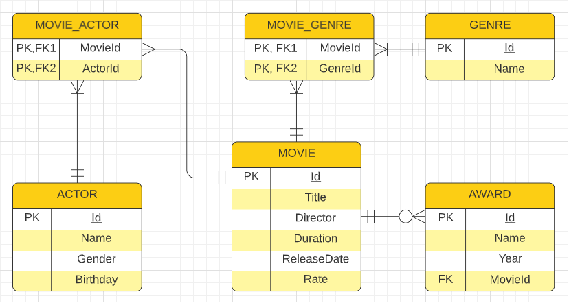

# :tv: Movie API :movie_camera: :clapper:

##### CSIT327 - *Information Management 2* Final Project
---

## Entity Relationship Diagram (ERD)

---

## :computer: API Overview
Our API revolves around **Movies** and its related attributes which includes **Actor**, **Genre**, and **Award**.

---

## :computer: API Features
### :movie_camera: Movies

| Method     | Endpoint                          | Description                       | Parameter Name | Parameter Data Type | Parameter Description |
|:---------- |:--------------------------------- |:----------------------------------|:------------------:|:-----------------------:|:-------------------------:|                       
| GET        | /api/Movies                       | Gets all movies                   | -                  | -                       | -                         |
| GET        | /api/Movies/{id}                  | Gets a single movie by a given id | id                 | integer                 | id of the movie           |
| GET        | /api/Movies/{id}/genres           | Gets all genres of a movie        | id                 | integer                 | id of the movie           |
| GET        | /api/Movies/{id}/actors           | Gets all actors of a movie        | id                 | integer                 | id of the movie           |
| GET        | /api/Movies/{id}/awards           | Gets all awards of a movie        | id                 | integer                 | id of the movie           |
| POST       | /api/Movies                       | Creates a movie                   | -                  | -                       | -                         |
| PUT        | /api/Movies/{id}                  | Updates an existing movie         | id                 | integer                 | id of the movie           |
| PUT        | /api/Movies/{id}/actors/{actorId} | Adds an actor to movie            | id actorId | integer integer | id of the movie id of the actor |
| PUT        | /api/Movies/{id}/actors/{genreId} | Adds a genre to movie             | id genreId | integer integer | id of the movie id of the genre | 
| DELETE     | /api/Movies/{id}                  | Removes a movie                   | id                 | integer                 | id of the movie           |
| DELETE     | /api/Movies/{id}/actors/{actorId} | Removes an actor from movie       | id actorId | integer integer | id of the movie id of the actor |
| DELETE     | /api/Movies/{id}/genres/{genreId} | Removes a genre from movie        | id genreId | integer integer | id of the movie id of the genre | 

---

### :family: Actors

|Method      |Endpoint                           |Description                        | Parameter Name | Parameter Data Type | Parameter Description |
|:---------- |:--------------------------------- |:----------------------------------|:------------------:|:-----------------------:|:-------------------------:|   
| GET        | /api/Actors                       | Gets all actors                   | -                  | -                       | -                         |
| GET        | /api/Actors/{id}                  | Gets a single actor by a given id | id                 | integer                 | id of the actor           |
| GET        | /api/Actors/{id}/movies           | Gets all movies of an actor       | id                 | integer                 | id of the actor           |
| POST       | /api/Actors                       | Creates an actor                  | -                  | -                       | -                         |
| PUT        | /api/Actors/{id}                  | Updates an existing actor         | id                 | integer                 | id of the actor           |
| PUT        | /api/Actors/{id}/movies/{movieId} | Adds a movie to an actor          | id movieId | integer integer | id of the actor  id of the movie |
| DELETE     | /api/Actors/{id}                  | Removes an actor                  | id                 | integer                 | id of the actor           |
| DELETE     | /api/Actors/{id}/movies/{movieId} | Removes a movie from an actor     | id movieId | integer integer | id of the actor id of the movie |

---

### :clapper: Genres

|Method      |Endpoint                           |Description                        | Parameter Name | Parameter Data Type | Parameter Description |
|:---------- |:--------------------------------- |:----------------------------------|:------------------:|:-----------------------:|:-------------------------:| 
| GET        | /api/Genres                       | Gets all genres                   | -                  | -                       | -                         |
| GET        | /api/Genres/{id}                  | Gets a single genre by a given id | id                 | integer                 | id of the genre           |
| GET        | /api/Genres/{id}/movies           | Gets all movies of a genre        | id                 | integer                 | id of the genre           |
| POST       | /api/Genres                       | Creates a genre                   | -                  | -                       | -                         |
| PUT        | /api/Genres/{id}                  | Updates an existing genre         | id                 | integer                 | id of the genre           |
| PUT        | /api/Genres/{id}/movies/{movieId} | Adds a movie to a genre           | id movieId | integer integer | id of the genre id of the movie |
| DELETE     | /api/Genres/{id}                  | Removes a genre                   | id                 | integer                 | id of the genre           |
| DELETE     | /api/Genres/{id}/movies/{movieId} | Removes a movie from a genre      | id movieId | integer integer | id of the genre id of the movie |

---

### :trophy: Awards

|Method      |Endpoint                           |Description                        | Parameter Name | Parameter Data Type | Parameter Description |
|:---------- |:--------------------------------- |:----------------------------------|:------------------:|:-----------------------:|:-------------------------:| 
| GET        | /api/Awards                       | Gets all awards                   | -                  | -                       | -                         |
| GET        | /api/Awards/{id}                  | Gets a single award by a given id | id                 | integer                 | id of the award           |
| POST       | /api/Awards                       | Creates an award                  | -                  | -                       | -                         |
| PUT        | /api/Awards/{id}                  | Updates an existing award         | id                 | integer                 | id of the award           |
| DELETE     | /api/Awards/{id}                  | Removes an award                  | id                 | integer                 | id of the award           |

---
### Prepared by:

**Group 8** - *The John's and a Flower*

**John Cadungog** \
john.cadungog@cit.edu

**John Mary Carmel Redillas** \
johnmarycarmel.redillas@cit.edu

**John Mark Senening** \
johnmark.senening@cit.edu

**Raphael Pierre Antonni Laconsay** \
raphaelpierreantonni.laconsay@cit.edu
